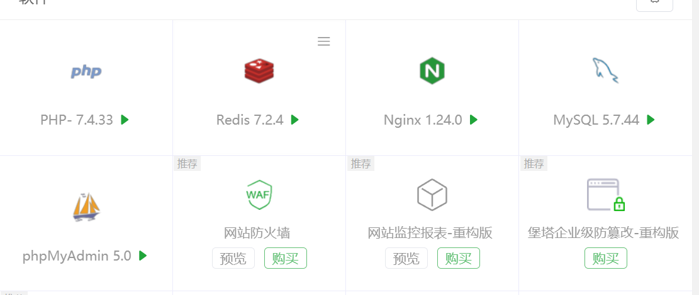
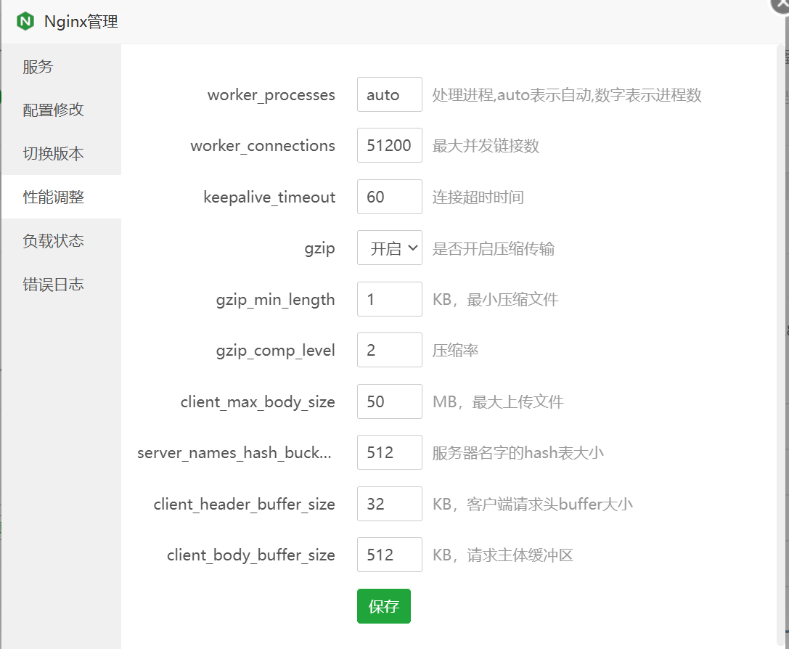
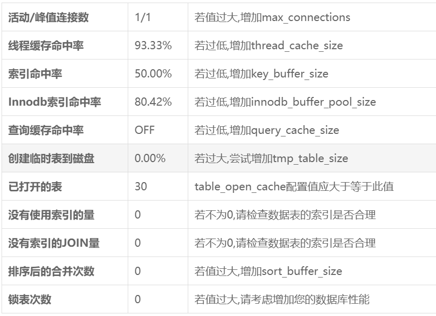
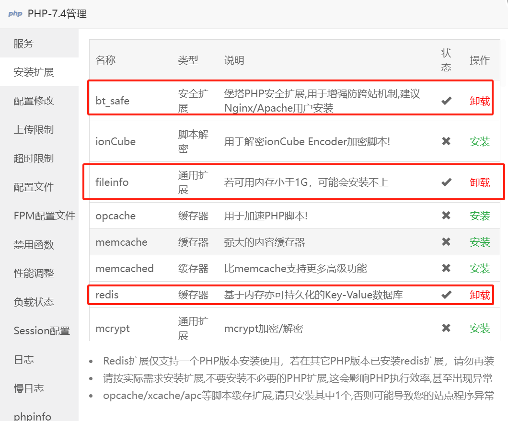
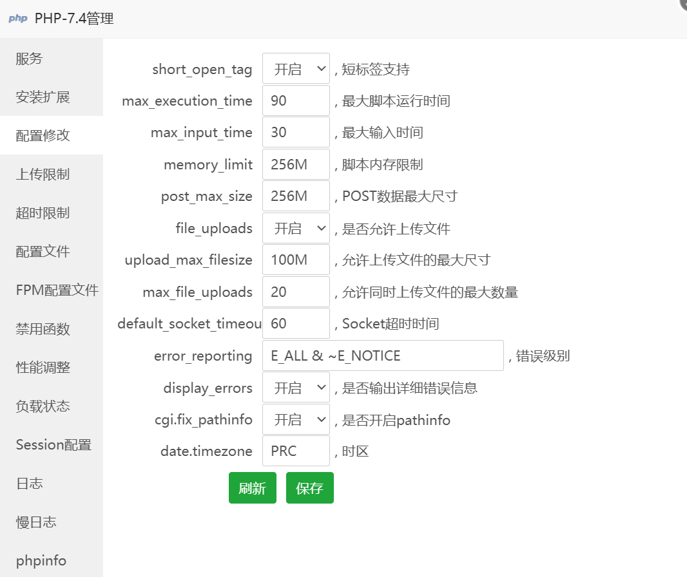
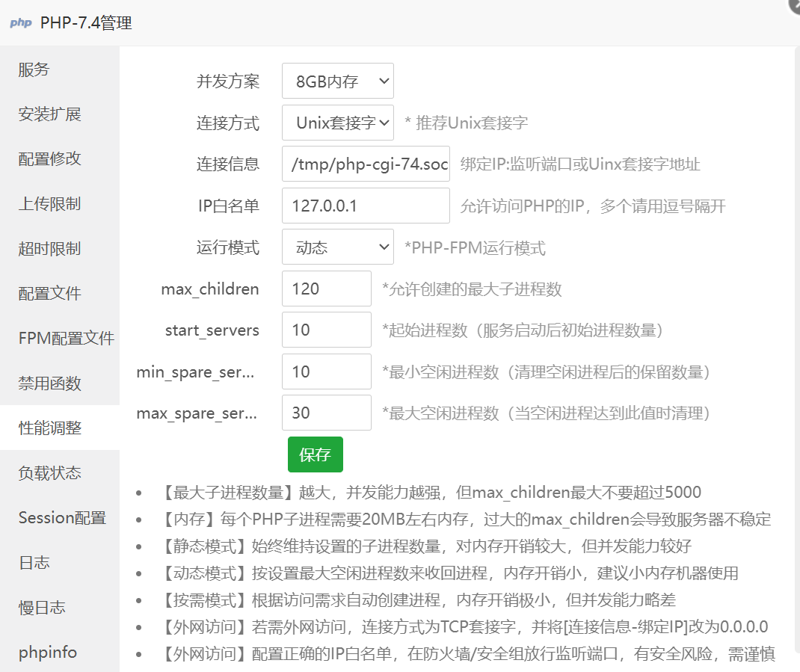

# 围绕宝塔面板开展的WP环境调优细节指南

>  此文受Miss之托才会出现在你们的视野中！
>
>  无作者Element授权，请勿转载！
>
>  遵循 AGPL-3.0 协议 原文地址为：[文章/围绕宝塔面板开展的WP环境调优细节指南.md · 元素/webBack - 码云 - 开源中国 (gitee.com)](https://gitee.com/elementxuan/web-back/blob/master/文章/围绕宝塔面板开展的WP环境调优细节指南.md)
>

# 1.我的主要需求以及环境选择

## 1.1我的需求

在选购服务器之时，就需要对即将运行的业务流有一个初步的构思，并根据此业务流进行一些适当的资源配比以及带宽量计算的构思。

下面的以我的实例举个例子：

我需要搭建两个WP网站和一个文档网站，WP没有选择的余地都是以伪静态规则的方式部署，而文档网站我的设计构思是单html页面所以暂且抛开不谈。

单个WP的源程序在15M左右，所以最最局限我们的磁盘空间要保留100M给WP，因为随着时间的流逝，文章数量会逐渐增加，数据库也会变大，在平常编写文档时WP会自动保存你的编辑文件，安装卸载的插件都会在你的数据库中留下它曾经的印记，如果你不去关注它 那么小恶魔也会慢慢成长哦！

但是真正吃空间的其实是围绕WP所需要的环境（Nginx  MySql  php  Redis*），本次主要要聊的就是关于配置环境的优化策略，所以我们要花费较大的篇幅先让朋友们了解一下他们的作用。

注：Redis非必要环境，但还是推荐大部分朋友安装，其以 value : key 的数据形式存储在内存中，大大减少了数据库的查询次数。

Nginx：一个轻量级、高性能、稳定性高、并发性好的HTTP和反向代理服务器。其真正的优势我认为是负载均衡和反向代理。

MySql：一种性能较高，开源的关系型数据库，在此补充一个知识点 开源≠免费。数据库如何理解呢？我们理解为一个网站就是我们经营的一家鞋店，当有顾客光临时，我们需要从仓库拿出来，简化来说就是鞋子入库出库行为，但我们现在经营的是一家Web网站，所以我们需要操作入库出库的对象是数据，那么数据库顾名思义就是存放数据的仓库啦！

php：是一款易于上手的服务端脚本语言，它只在服务器上执行。我对该 “世界上最好的语言” 不太感冒，虽然8.0以及之后的版本进步喜欢，但是失去的市场就是失去了很难再挽回。

## 1.2我的配置选择
我使用的是一款 2核心 4G内存 6M宽带 50G固态的云服务器，最让我惊喜的是其居然赠送100G的ddos 月/次，爽！

这一小节给大家划重点的其实是 如何选择合适你的带宽！

服务器带宽一般分为上行带宽，下行带宽，公网带宽，内网带宽：

- 上行带宽(在购买服务器时标注的参数)：是指服务器传输给客户端的带宽。 如从服务器下载文件，消耗的是服务器的上行带宽。 
- 下行带宽(通常不限)：是指客户端上传文件到服务器，消耗的是服务器的下行带宽。 
- 公网带宽：通过公网ip产生的流量所占带宽。 
- 内网带宽：多台服务器处于同一网段，通过内网ip产生的流量所占带宽。

也许有朋友会说：这我知道啊！越大越好呗！我： 汗颜“富哥，我们交个朋友吧！” 要知道带宽是服务器费用占用中大头呀！<

闲话少叙，服务器一般标注的单位是Mbps，例如1Mbps常称之为1M带宽。需要注意的是，1Mbps带宽并不表示每秒的速度可达1M，1Mbps带宽的最大速度为128kb每秒，2Mbps的速度则为256kb每秒，依此类推。

我们需要掐算单页面需要请求多少资源，又有多少人同时发起请求。

ex：e-yuansu.com 的某个页面大小是 100k，有1位客户在1秒中打开了这个页面，而云服务器1M宽带理论最大速度是128kb)（实际速度是绝对达不到的，这是个理想值）。

此计算公式为：

1位访问客户 * 1个页面=1 * 100= 100kb，那么我们1M(128kb)目前能吼得住,能够确保这位客户在1秒 中打开该页面。

ok 现在又有客户来访了哦！  他们很巧合的在同一秒访问这个100k的页面，此时计算公式为：

2位客户*2个页面 = 2  *  200 = 400kb，现在我们的1M宽带就吼不住啦 ！2位客户都需要等待2秒才能访问你的网页。要知道网页有个8秒定律。你的网站加载耗时每增加1秒，就会减少20%的访问用户。

# 2.环境版本选择

这个方面其实纯粹是 萝卜青菜，各有所爱的一个环节。

要知道WP的主推PHP版本已经是8.0了，而且裸WP确实是上高版本的PHP更加的快，但是我们要知道，我们的网站不是只有一个WP，我们还有各种插件扩展，大家还会安装各式的主题，这时如果不顾一切盲目的更新高版本，会出现各种兼容性的问题。

这是站长朋友需要心里抉择的，是更稳定的网站环境，还是拥抱新技术，新功能，但是有出现各种Bug的风险呢? 

### 2.1我的环境版本成列

由于我的网站定位是企业站，所以稳定为第一要义。如果你也追求稳定可以参照我的版本。

服务器系统版本：OpenCloudOS 9

Nginx：1.24.0

PHP：7.4.33

MySql：5.7.44(注:极不推荐最新版本)

Redis：7.2.4

phpMyAdmin：5.0

# 3.开始优化

每个人的服务器配置都是不一样的，可能你是云主机，裸金属，弹性云，轻量应用；所以请理解原理，而不是照搬照抄！

## 3.1 Nginx

相较于老前辈Apache，其在性能方面以及资源占用更加有优势，对于他的优化我们直接使用Auto即可，因为调整它对于WP站点的加速没有很大提升。

这是我的配置截图，最主要的就是开启gzip压缩，但一般默认配置已开启了。

## 3.2MySql

你的服务器内存小于4G时，高于5.7的版本是安装不上的，数据库基本是一个网站的命脉所在，我们完全没有必要追求高版本。

虽然高版本代表着更加强悍的新能，但其内存资源的占用也是成正比例上升的。

数据库的优化是完全没有办法照抄的，必须找对着当前状态长期的调优，注意是长期，一次调整只代表着一个阶段的最优设置，除非你的网站在本次调整后不再跟新。

注：已打开的表、没有使用索引的量、没有使用索引的JOIN量、排序后的合并次数、锁表次数，这几项都是大数据量查询读写才会出现涉及到。

今天只给大家带来2项调整

**innodb_buffer_pool_size** ：设置为服务器内存的50%-70%即可。WP 网站通常使用 InnoDB 存储引擎。根据服务器内存大小，设置 **innodb_buffer_pool_size** 可以有效提升数据库性能。

最大连接数调整：大家网站的连接数正常情况下不会很高，我们适当降低最大连接数可以节省内存。如您的配置确实不错那也可适当调高。

例如：4G 内存建议值：200；6G 内存建议值：350。

## 3.3 PHP

php分为了两个地方 “安装扩展” 和 “配置修改”。

配置我只安装了这三个扩展，就以足够，如果你并没有使用Redis那么 redis扩展也无需安装。

配置修改页面大多数保持默认也可以。但有几处关键点我需要陈述一下！

-  **max_execution_time**：页面执行时间，页面上的任何读写都属于执行，超过设置的时间就会被系统中断，它旨在最大程度地减少服务器滥用。这个值一般设置成60或90即可。太少，会导致用户的一些操作被系统中断。太长，一些插件线程会长期占用。另外，恶意攻击也会因为你设置的值过大而撑爆你的服务器性能，导致网站瘫痪。我这里为了演示设置成600秒，实际我个人在使用90。
-  **max_input_time**：最大输入时间设置允许脚本解析输入数据（如 POST 和 GET）的最大时间（秒）。计时从 PHP 在服务器上调用的那一刻开始。这个设置影响我们上传大型文件，因为越大的文件上传时间就越长，超时就会被系统中断。如果你的网站没有视频等大文件上传，这个值可以设置60或更低。
-  **memory_limit**：限制单个脚本能分配到的最大内存。不超过512M即可，比较主流的设置是256M。这个值太大，一些脚本就会因为高频滥用拖慢服务器。
-  **post_max_size**：指通过表单POST给PHP的所能接收的最大值，包括表单里的所有值。设置成256就已经很够了。注意，此处的设置要比下方upload_max_filesize大。
-  **upload_max_filesize**：允许上传的单个文件最大限制。如果你的网站不传视频、软件、游戏等大容量内容。那么可以将它设置为5M，如果要上传超清照片，可以设置为20M。
-  **default_socket_timeout**：socket流的超时参数，即socket流从建立到传输再到关闭整个过程必须要在这个参数设置的时间以内完成，如果不能完成，那么PHP将自动结束这个socket并返回一个警告。类似的一个PHP配置是connection_timeout，不过connection_timeout是指保持连接的时间超时，不包括创建和销毁连接。设置为60够用了。
-  

